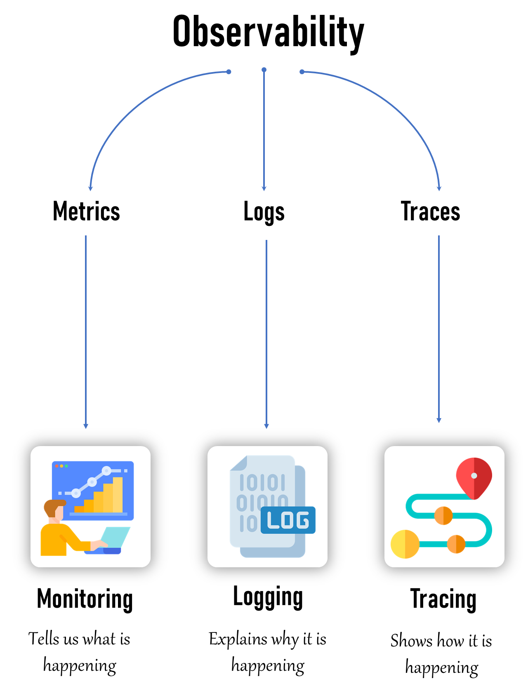
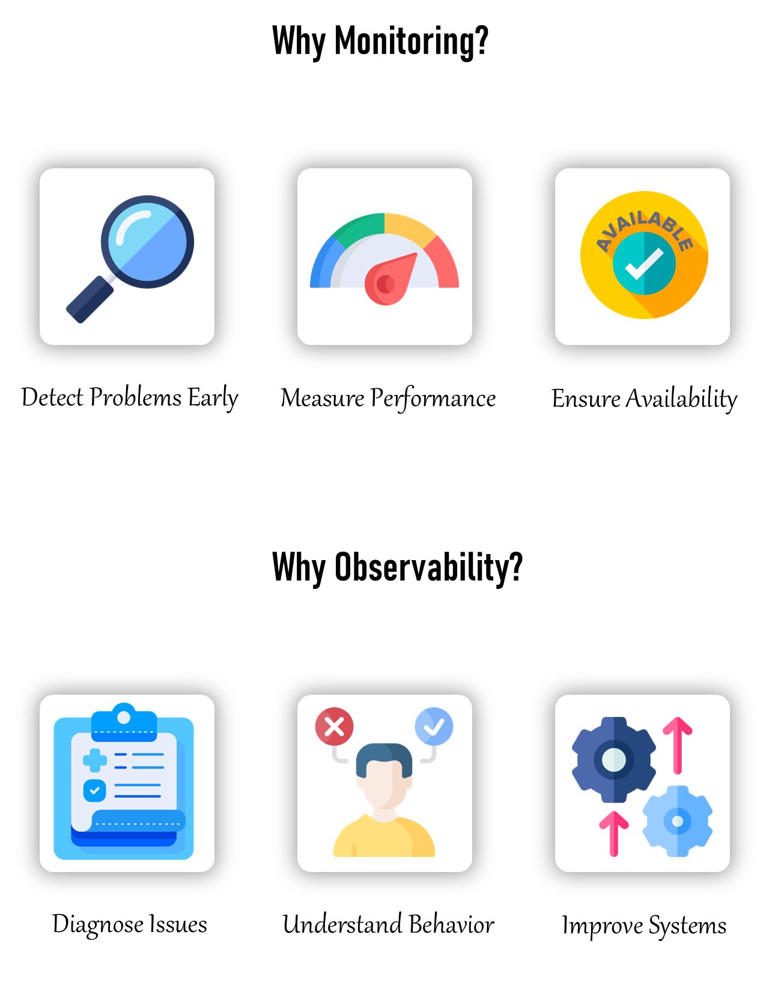

# 💡 Introduction to Observability
- Observability is the ability to understand the internal state of a system by analyzing the data it produces, including logs, metrics, and traces.

- Monitoring(Metrics): involves tracking system metrics like CPU usage, memory usage, and network performance. Provides alerts based on predefined thresholds and conditions
    - `Monitoring tells us what is happening.`
- Logging(Logs):  involves the collection of log data from various components of a system.
    - `Logging explains why it is happening.`
- Tracing(Traces): involves tracking the flow of a request or transaction as it moves through different services and components within a system.
    - `Tracing shows how it is happening.`

## 🤔 Why Monitoring?
- Monitoring helps us keep an eye on our systems to ensure they are working properly.
- Perpose:  maintaining the **health, performance, and security** of IT environments.
- It enables early detection of issues, ensuring that they can be addressed before causing significant downtime or data loss.

- We use monitoring to:
    - Detect Problems Early
    - Measure Performance:
    - Ensure Availability:

## 🤔 Why Observability?
- Observability helps us understand why our systems are behaving the way they are.
- It’s like having a detailed map and tools to explore and diagnose issues.

- We use observability to:
    - Diagnose Issues:
    - Understand Behavior:
    - Improve Systems:

## 🆚 What is the Exact Difference Between Monitoring and Observability?
- 🔥 Monitoring is the *`when and what`* of a system error, and observability is the *`why and how`*

| Category       | Monitoring                                   | Observability                                         |
|----------------|----------------------------------------------|------------------------------------------------------|
| Focus          | Checking if everything is working as expected| Understanding why things are happening in the system  |
| Data           | Collects metrics like CPU usage, memory usage, and error rates | Collects logs, metrics, and traces to provide a full picture |
| Alerts         | Sends notifications when something goes wrong| Correlates events and anomalies to identify root causes |
| Example        | If a server's CPU usage goes above 90%, monitoring will alert us | If a website is slow, observability helps us trace the user's request through different services to find the bottleneck |
| Insight        | Identifies potential issues before they become critical | Helps diagnose issues and understand system behavior |

## 🔭 Does Observability Cover Monitoring?
- Yes!! Monitoring is subset of Observability
- Observability is a broader concept that includes monitoring as one of its components.
- monitoring focuses on tracking specific metrics and alerting on predefined conditions
- observability provides a comprehensive understanding of the system by collecting and analyzing a wider range of data, including **logs, metrics, and traces**.

## 🖥️ What Can Be Monitored?
- Infrastructure: CPU usage, memory usage, disk I/O, network traffic.
- Applications: Response times, error rates, throughput.
- Databases: Query performance, connection pool usage, transaction rates.
- Network: Latency, packet loss, bandwidth usage.
- Security: Unauthorized access attempts, vulnerability scans, firewall logs.

## 👀 What Can Be Observed?
- Logs: Detailed records of events and transactions within the system.
- Metrics: Quantitative data points like CPU load, memory consumption, and request counts.
- Traces: Data that shows the flow of requests through various services and components.

## 🆚 Monitoring on Bare-Metal Servers vs. Monitoring Kubernetes
- Bare-Metal Servers:
    - Direct Access: Easier access to hardware metrics and logs.
    - Fewer Layers: Simpler environment with fewer abstraction layers.

- Kubernetes:
    - Dynamic Environment: Challenges with monitoring ephemeral containers and dynamic scaling.
    - Distributed Nature: Requires tools that can handle distributed systems and correlate data from multiple sources.

## 🆚 Observing on Bare-Metal Servers vs. Observing Kubernetes
- Bare-Metal Servers:
    - Simpler Observability: Easier to collect and correlate logs, metrics, and traces due to fewer components and layers.

- Kubernetes:
    - Complex Observability: Requires sophisticated tools to handle the dynamic and distributed nature of containers and microservices.
    - Integration: Necessitates the integration of multiple observability tools to get a complete picture of the system.

## ⚒️ What are the Tools Available?
- **Monitoring Tools**: Prometheus, Grafana, Nagios, Zabbix, PRTG.
- **Observability Tools**: ELK Stack (Elasticsearch, Logstash, Kibana), EFK Stack (Elasticsearch, FluentBit, Kibana) Splunk, Jaeger, Zipkin, New Relic, Dynatrace, Datadog.

