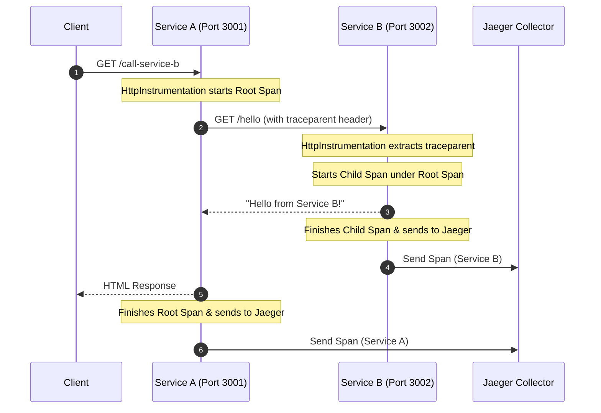

# In-Depth Metrics & Instrumentation Analysis: Service B

This document provides a detailed, technical analysis of `service-b`. It explains the current instrumentation status, logic flow, and its integration in the distributed tracing architecture.

---

## 🗺️ Project Architecture Overview

`service-b` is a lightweight Node.js web application built with the **Express** framework. It serves as a downstream dependency for `service-a`.
- **Primary Endpoint:** Exposes a simple `GET /hello` route returning the string `"Hello from Service B!"`.
- **Port:** Runs on port `3002`.
- **Observability Profile:** Unlike `service-a`, `service-b` focuses primarily on **Distributed Tracing** to participate in the request lifecycle initiated by upstream callers.

---

## 📦 Key Dependencies

The dependencies match `service-a`:

| Package | Purpose |
| :--- | :--- |
| `@opentelemetry/sdk-node` | OpenTelemetry Node.js SDK to bootstrap tracing. |
| `@opentelemetry/exporter-jaeger` | Exporter to ship spans to the Jaeger collector. |
| `@opentelemetry/instrumentation-express` / `http` | Automatic hook interception to trace Express routes and incoming HTTP requests. |
| `morgan` | Standard HTTP request logger middleware. |
| `prom-client` | Declared in `package.json`, but currently **unused** in the application code. |

---

## 📈 Metrics Instrumentation Status

> [!WARNING]
> **No Custom Metrics Configured in Code**
>
> Although `prom-client` is defined in `package.json`, [index.js] does not import or implement any metric tracking (no counter, histogram, gauge, or `/metrics` endpoint). 

If metrics collection is needed for `service-b` in the future, it should follow the same Express middleware pattern implemented in `service-a` to expose a `/metrics` scrape endpoint.

---

## 🔍 Tracing Instrumentation (OpenTelemetry)

`service-b` uses OpenTelemetry for distributed tracing. Tracing is initialized via [tracing.js].

### 1. Initialization Order
Just like `service-a`, tracing must be initialized at the very entry point of the process before any other modules:
```javascript
require('dotenv').config();
require('./tracing'); // Must load first to patch http and express
const express = require('express');
```

### 2. Tracing Configuration
*   **Service Name:** Configured specifically as `service-b` to distinguish its trace spans from `service-a` in Jaeger.
    ```javascript
    [SemanticResourceAttributes.SERVICE_NAME]: 'service-b'
    ```
*   **Exporter:** Spans are pushed to the collector at the URL specified by `process.env.OTEL_EXPORTER_JAEGER_ENDPOINT`.
*   **Span Processor:** Uses a `SimpleSpanProcessor` to send tracing data synchronously to Jaeger.
*   **Auto-instrumentation:** Automatically intercepts incoming `http` calls and routes them through the `ExpressInstrumentation` middleware to capture execution time as spans.

---

## 🔄 Distributed Trace Context Propagation

The primary role of `service-b` is to serve downstream requests from `service-a`. Distributed tracing allows these requests to be correlated across network boundaries.

Here is how the trace context propagates between the two services:



### Context Propagation Process:
1.  **Trace Headers Injection:** When `service-a` makes an outgoing HTTP request to `service-b` using `axios`, OpenTelemetry's `HttpInstrumentation` in `service-a` intercepts the call and injects a standard W3C trace context header (e.g. `traceparent: 00-4bf92f3577b34da6a3ce929d0e0e4736-00f067aa0ba902b7-01`) into the request headers.
2.  **Trace Headers Extraction:** When `service-b` receives the HTTP request at `GET /hello`, its own `HttpInstrumentation` intercepts the request and extracts the `traceparent` header.
3.  **Parent-Child Linking:** Rather than starting a new trace, `service-b` reads the trace ID (`4bf92...`) and parent span ID (`00f06...`) and creates a **child span** under that trace.
4.  **Correlation in Jaeger:** Both services ship their spans to Jaeger. Jaeger joins these spans using the common Trace ID, rendering a single end-to-end timeline chart of the request showing how much time was spent in `service-a` versus `service-b`.
